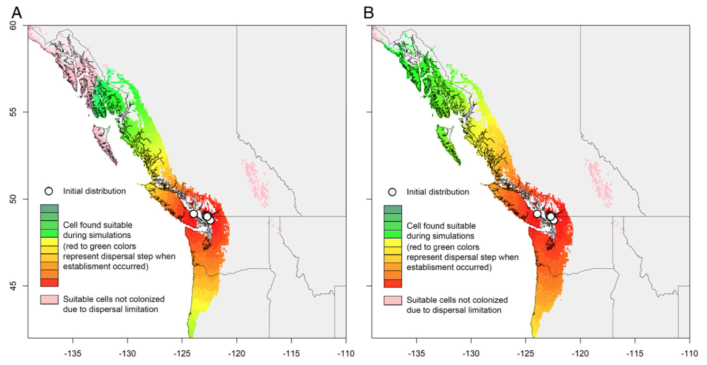

```{r setup, include=FALSE}
knitr::opts_chunk$set(echo = TRUE)
```

## Introduction

Introduction to the paper will go here. 

## Methods

Methods text goes here.

## Results and Conclusion

Results/conclusion text goes here.


``` {r }
plot(0:1, type = "l", xlab = "Climate suitability", ylab = "Human footprint")
```

## Bibliography

Bibliography goes here.

